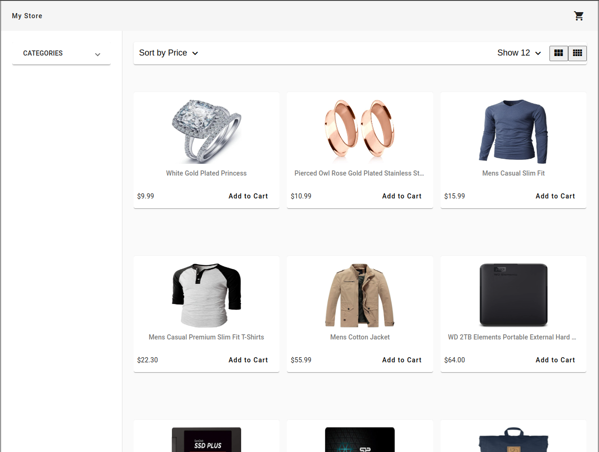
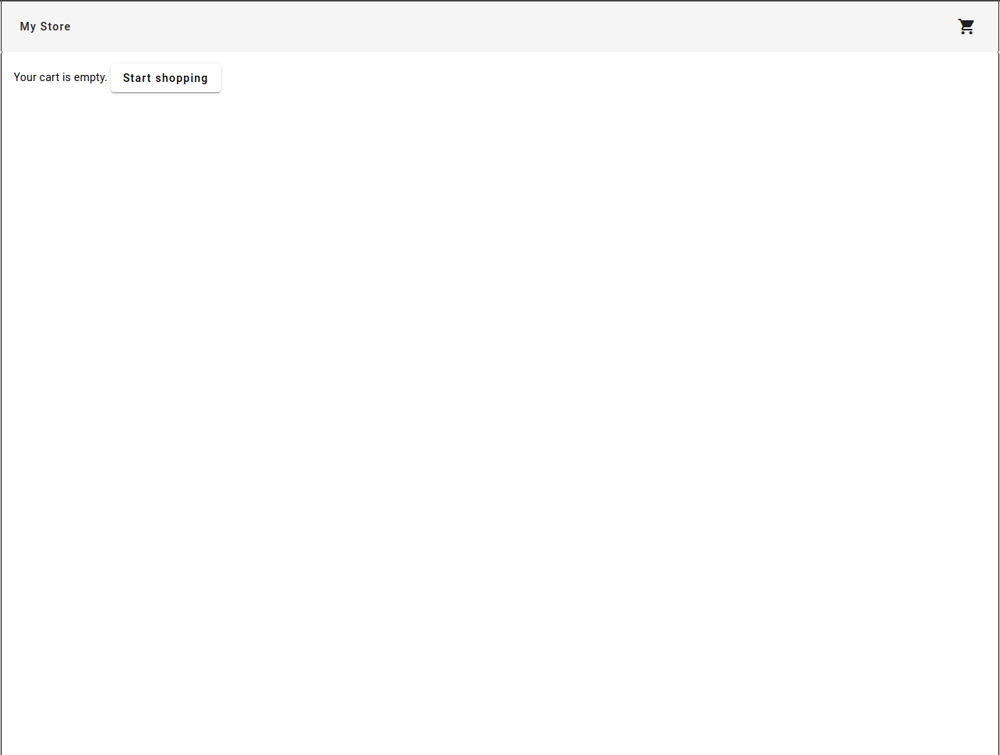
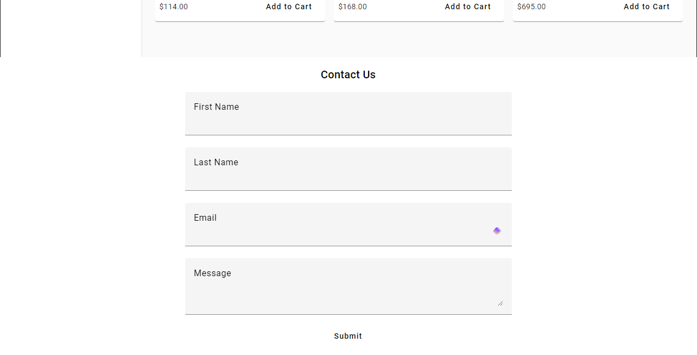

# Tutorial

I am using this tutorial to understand how to put together an ecommerce store, as well as refactoring code from this tutorial to fit with Angular 17. 

https://youtu.be/Kbauf9IgsC4?si=hKzwGe9--02Z7iFB

# FakeStoreAPI
this store was implemented using json from https://fakestoreapi.com/

# HOME pag

# CART page

# CONTACT footer

